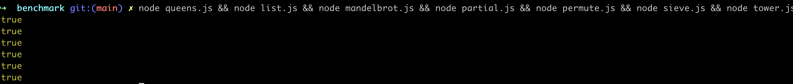
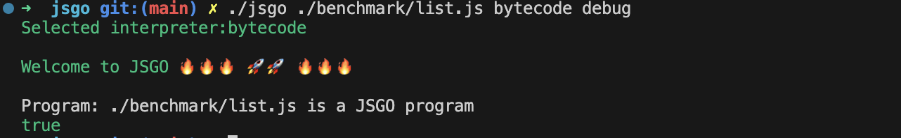
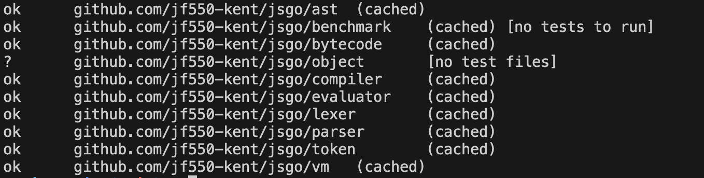
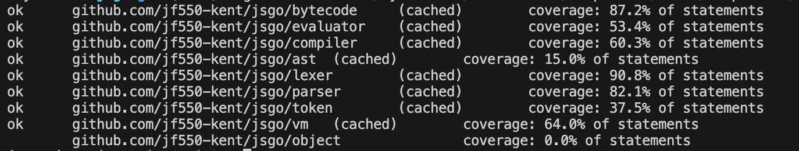

<div style="text-align: justify">

# 5. Result
We successfully built $Inter_{bytecode}$ and $Inter_{tree}$ for our $L_{JSGO}$. The user can access the interpreter from [Github](https://github.com/jf550-kent/jsgo/releases). **Code 1** shows the command for the interpreter. The user need to specifiy the file name first and then the mode of interpreter to run the program. To enable the checker and partial evaluation you can pass in the optional command `debug`. 
**5 Code 2** shows how you can run the `example.js` file in different options.

```
./jsgo <filename> <tree|bytecode> [debug] [-version]
```
**5 Code 1**
```
./jsgo example.js tree 
./jsgo example.js bytecode
./jsgo example.js bytecode debug
```
**Code 2**v

The language can support all the features mentioned in methodology section 3.1. See Code 3, a list of our langauge capability. In Line 1, we can declare a var statement and Lines 2 - 4 we can assign a value to an identifier. The data type our langauge supports are `null`, string literal, number, float, boolean. We can perform operation between number and float see Line 4. We support bitwise operation `^` and `&` for number see Lines 5 - 6. Lines 5 - 14, illustrates how our language supports binary operations and unary operations with the correct precedence. Interestingly, our string literal supports `/` escaping see Line 35 where we log an emoji. For composite data structure we support array, and objects. See Lines 26 - 29, for array declaration, index and the built in push method and accessing the array length. Lines 31 to 32 shows how to handle objects. Our language can supports recursion and closure see Lines 16 - 22. Lastly, we can define a for loop in Lines 24 and if/else in Lines 37 - 39.

```
var apple = 10;
apple = "Yellow";
apple = null;
apple = 80 + 9.0
8 ^ 7; 
8 & 9; 
!true; 
!false;
9 + 9;
9 - 1.0;
9 * 1.0 + 19;
9 / 10;
90 != 90;
9 == 3;

var recur = function(a) {
  if (a == 1) {
    return 1;
  }
  var b = a
  return b + recur(b - 1);
}

for (var i = 0; i < 10; i = i + 1) {}

var arr = [9, 9.0, true]
arr[0] // 9
arr["push"](10) // arr -> [9, 9.0, true, 10]
arr["length"] // 4

var obj = { "value": 9, "next": 9 }
obj["value"] // 9

var smile = "\u2603" 
console.log(smile) -> ☃

if (true) {
} else {
}
```
Code 3

Furthermore, all of the benchmarks mentioned in section 3.5 can be run by $Inter_{tree}$. Our partial evaluator can produce correct result when used with our interpreter. For $Inter_{bytecode}$ it can run all the benchmarks execpt for Mandelbrot and Sieve. This is because of constraints on the project, we were unable to create additional features to support Mandelbrot and Sieve. See Table for the result of our interpreter performance. 

Our benchmarks have rewritten and the implementation were tested. We end each benchmarks's with a boolean variable to identicate if the bencmark evaluate to pass or fail, so we log all the benchmarks's last line by running the node command. **Diagram 1** show the result of running all the benchmarks which logged all true. This means that our JS implementations is correct. 


**Diagram 1**

To check if a source code is part of $L_{JSGO}$ we created a definition interpreter to check the correctness of our AST. You can enable it by passing in the `debug` in the command. Diagaram show the command and result when you use `debug` and it will log out if the JS file you have provided is part of our language.


All the tests created have passed in this project. **Diagram 2** shows result of all passed tests when we run the tests.


**Diagram 2**

## 6.0 Evaluation

### 6.1 Discussion correctness
We wrote tests to check the correctness of our implementations. Diagram 6.1 shows the code coverage of our projects. Our testing strategy was straightforward: for any feature we wanted our program to support, we write tests to verify the implementations. We did not focus on code coverage, so some of our packages have lower than expected statements coverage. For instance, in the evaluator package which is our $Inter_{tree}$ implementation has 53.4% statements, thus ideally we could aim for at least 60% coverages. Whereas, all other packages achieved 60% or higher coverage, except for ast, token, and object which are packages used for struture definition.

Despite that we did not have high average coverage, we still managed to create an interpreter that can run the set of benchmarks in Section 3.1. This demonstrates that we can balance lower code coverage for a code base, as long as key functional requirements are thoroughly tested.

Our tests helped us to iterate with speed and confidence. Through creating tests for the features we inteded to support, we can ensure that new changes do not break existing functionality. There are many instances where new features broke exisitng tests, but these failing tests allowed us to quickly debug and fix our code errors.

Buuilding and maintaining tests requires effort, and we estimated that we spend an equal amount of time between testing and code implementation. However, the effort invested into testing is justifiable by the benefits our program's correctness outweigh the costs of setting up the tests.

Diagram 6.1

### 6.2 Discuassion of performance
We created benchmarks to measure each components of our interpreter's performance. The benchmark setup can be referenced [HERE](https://github.com/jf550-kent/jsgo/blob/main/benchmark/). These benchmarks were conducted on a Linux system with an AMD EPYC 7763 64-Core Processor, targeting the amd64 architecture.

Firstly, **Table 1 of 6.2** and **Table 2 of 6.2** shows the result of the benchmarks we have created for our lexer name `BenchmarkLex` and parser named `BenchmarkExample` . The tables are in a format where each row represent a record of the benchmark we have specified. There are more records of the benchmarks located in the [performance](https://github.com/jf550-kent/jsgo/tree/main/performance) folder, but in the tables we only present the key results.

We set up CI to automate the recording of benchmarks and wrote the results into a txt file with the date as the name. We had to manually add the name of a PR on to the file name, because we did not have enough time to figure out how to automate this in CI. We can treat the additonal PR name in the FileName indifferent to the rest of the file.

Initially, we used **Code 1 of 6.2** as our input to benchmark the lexer and parser's performance. However, the drastic change in FileName `2024-08-15_14-35-56.txt`'s metrics is because we have added all the code implementations of our "Are fast yet" code into the input file used to benchmark the lexer and parser.

To interpret a record from **Table 1 of 6.2** or **Table 2 of 6.2**, we will use the record with FileName `2024-08-15_14-35-56.txt` in **Table 2 of 6.2** as an example. In the record of `BenchmarkExample` the parser's benchmark, it ran 1 time (Count) and each time took 32901787358 nano seconds (Time), used 3295575488 bytes (Memory) and 408361488 allocations (Allocations). 

The performance of the lexer's implementations is relatively stable. Although the input source code has increased, the metrics have only increased sightly. Therefore, we can conclude that tokenising is not as resource-intensive relatively to our parser. In the parser we can see an increased of time taken from 854.9 ns/op to 32901787358 ns/op . This is expected as we have added alot of source code from 10 line of codes to 263 line of codes. As the parser performs alot of nested recursive functions.

Lexer benchmark: BenchmarkLex
| FileName                                       | Count    | Time (ns/op) | Memory (B/op) | Allocations (allocs/op) |
|------------------------------------------------|----------|--------------|---------------|-------------------------|
| 2024-08-05_22-23-57_NULL.txt                   | 18110000 | 69.76        | 8             | 1                       |
| 2024-08-02_18-55-50_Assignment.txt             | 18694759 | 63.06        | 8             | 1                       |
| 2024-08-06_14-22-05.txt                        | 18361929 | 65.30        | 8             | 1                       |
| 2024-08-06_15-28-32_Object_Key_Declaration.txt | 18214057 | 65.32        | 8             | 1                       |
| 2024-08-15_14-35-56.txt                        | 18445549 | 64.46        | 8             | 1                       |
| 2024-08-07_20-18-17_Bit_Operation.txt          | 18338833 | 64.46        | 8             | 1                       |
| 2024-08-02_19-21-02.txt                        | 18879171 | 62.84        | 8             | 1                       |
| 2024-07-28_14-07-40.txt                        | 19014081 | 62.90        | 8             | 1                       |
| 2024-08-15_17-35-58.txt                        | 18378296 | 64.60        | 8             | 1                       |
| 2024-08-11_20-34-52.txt                        | 18143056 | 65.39        | 8             | 1                       |
| 2024-08-15_14-33-19.txt                        | 18559951 | 64.25        | 8             | 1                       |

**Table 1 of 6.2**

Parser benchmark: BenchmarkExample
| FileName                                       | Count   | Time (ns/op) | Memory (B/op) | Allocations (allocs/op) |
|------------------------------------------------|---------|--------------|---------------|-------------------------|
| 2024-08-05_22-23-57_NULL.txt                   | 1405509 | 861.7        | 912           | 14                      |
| 2024-08-02_18-55-50_Assignment.txt             | 1379966 | 895.4        | 912           | 14                      |
| 2024-08-06_14-22-05.txt                        | 1376535 | 861.5        | 912           | 14                      |
| 2024-08-06_15-28-32_Object_Key_Declaration.txt | 1399807 | 854.9        | 912           | 14                      |
| 2024-08-15_14-35-56.txt                        | 1       | 32901787358  | 3295575488    | 408361488               |
| 2024-08-07_20-18-17_Bit_Operation.txt          | 1       | 33133414273  | 3295578456    | 408361511               |
| 2024-08-15_17-35-58.txt                        | 1       | 32972786530  | 3295570496    | 408361464               |
| 2024-08-11_20-34-52.txt                        | 1       | 33381851782  | 3295574672    | 408361510               |
| 2024-08-15_14-33-19.txt                        | 1       | 33247364538  | 3295575032    | 408361510               |

**Table 2 of 6.2**
Table: `ns` is nanosecond, `B` is bytes, `allocs` allocations


```
var apple = 9;
var appleExample = 10;

apple + appleExample;

var add = function(a) {
  return a + a;
};

add(apple, appleExample);
```
**Code 1 of 6.2** 

**Table 3 of 6.2** shows the result of benchmarking the benchmarks specified in Section 3.5. In the Benchmark column, if part of the name has Tree means it uses the $Inter_{tree}$, Bytecode means it is using $Inter_{bytecode}$ and if Debug is present after Tree means that we partial evaluate the AST before passing into the repestive interpreter.

To interprete BenchmarkListTree-4, it means that the List program was executed 82 times by our $Inter_{tree}$. Each execution took 12434228 ns/op, used 3,377,390 bytes of memory, and allocated memory 75,797 times.

We managed to run all the benchmarks specified for our $Inter_{tree}$. Additionally, we enabled partial evaluation for each benchmark. As evident, some benchmarks benefit from the optimisation; however, there are cases where performance is actually poorer. For example, on average BenchmarkQueensTreeDebug-4 took 19790 ns/op more to execute and used 100 more bytes compared to BenchmarkQueensTree-4. This is because we traverse the AST and rebuild some of the nodes during the partial evaluation stage. Therefore, it makes sense to use a partial evaluator only when the performance gain outweighs the cost of partially evaluating the nodes.

Evidently there is a performance improvement where benchmarks were ran by the $Inter_{bytecode}$, the time takens is reduced and memory usage is reduced. Apart from BenchmarkListBytecode-4 where it has used 459077 more bytes of memory compare to BenchmarkListTreeDebug-4.

| Benchmark                      | Count | Time (ns/op) | Memory (B/op) | Allocations (allocs/op) |
|--------------------------------|-------|--------------|---------------|-------------------------|
| BenchmarkListTree-4            | 82    | 12434228     | 3377390       | 75797                   |
| BenchmarkListTreeDebug-4       | 93    | 12426883     | 3377546       | 75799                   |
| BenchmarkListBytecode-4        | 122   | 9723327      | 3836623       | 86373                   |
| BenchmarkTowerTree-4           | 39    | 28821471     | 15799438      | 282907                  |
| BenchmarkTowerTreeDebug-4      | 42    | 28807471     | 15799611      | 282908                  |
| BenchmarkTowerBytecode-4       | 121   | 9912466      | 2703388       | 82652                   |
| BenchmarkMandelbrotTree-4      | 1     | 33679514731  | 3261057064    | 407626929               |
| BenchmarkMandelbrotTreeDebug-4 | 1     | 32879780784  | 3261052808    | 407626897               |
| BenchmarkPermuteTree-4         | 68    | 15844331     | 8315216       | 145896                  |
| BenchmarkPermuteTreeDebug-4    | 69    | 15886919     | 8315383       | 145898                  |
| BenchmarkPermuteBytecode-4     | 244   | 4915347      | 1763794       | 45090                   |
| BenchmarkSieveTree-4           | 145   | 8212330      | 1201700       | 108937                  |
| BenchmarkSieveTreeDebug-4      | 145   | 9026527      | 1201843       | 108939                  |
| BenchmarkQueensTree-4          | 96    | 11772284     | 5929917       | 123239                  |
| BenchmarkQueensTreeDebug-4     | 92    | 11792074     | 5930017       | 123169                  |
| BenchmarkQueensBytecode-4      | 307   | 3880841      | 1620185       | 37608                   |
Table: `ns` is nanosecond, `B` is bytes, `allocs` allocations
**Table 3 of 6.2**

## Trade off setting up engineering infrastruture
The benefits of CI are automation of benchmarks measurement, static checking, linting and running tests. This remove the process of manually running each actions, which allows us to focus on the interpreter constructions. However, the downside are time spent initially on learning technologies unrelated to interpreter constructions to set up the CI and efforts on designing the engineering infrastruture. For instance, we estimated that we have spent 4 days in learning Github actions, setting up the infrastruture and testing it. Even though the CI is set up there are still some limitations such as unable to get the PR name in the github action evironement mentioned in section 6.2. Overall, setting up engineering infrastrures helps our interpreter construction process. However, it is important to first consider the tradeoff between time invested in the setting up the infrastrures and the benefit gained from it.

### Insights and lesson learnt
One of the goals of this paper is to offer readers an introduction to the fundamental concepts of building a programming language, through assessing the lessons learned from our language construction, we hope to provide readers with insightful guidance for those who wish to implement their own interpreter.

For instance, one of the challenges when building the lexer was supporting UTF-8 representations for string literals. In our language, string literals are declared inside double quotes "". Initially, we assumed that supporting escape sequences with `\` would be a trivial task. We plan to support features such as handling common escape sequences such as `\n` for new lines, `\t` for tabs, and allowing Unicode characters within strings, see **Table 4 of 6.2**. However, implementing this feature proved to be more complex than anticipated, particularly in processing multi-byte UTF-8 characters. We first had to thoroughly understand how our host language represents strings and then develop additional code (l.convertString) to correctly convert these into UTF-8 code points. This added complexity not only increased the maintenance efforts and additional testing but also imposed a greater workload on the lexer at runtime, as each string literal needed extra processing to convert the escape sequences. 

|source|result|
|------|------|
|"\n"  | newline|
|"\t"  | tab |
|"\U0001F600" | 😀|
|"\u2603"|☃|
**Table 4 of 6.2**

Processing UTF-8 string literal is complicated and creates additonal burden to the interpreter.Therefore, when we are building an language it is crucial to consider the features we want to support and why before implementing them. This approach helps us to aviod spending time on unnecessary features.

Majority of our time and effort was devoted to constructing the parser. We have to consider how to represent each node for our language features, and devising strategies to determine which nodes to create by peeking ahead at tokens. One of the main reasons for this extensive effort was our lack of prior experience in parsing source text into an Abstract Syntax Tree (AST). We had to allocate time to learning and understanding the concepts, such as the expression parsing algorithm, which took us five days to fully grasp.

However, someone with more experience in the syntactic phase of language implementation could potentially build the parser more efficiently. For readers developing a domain-specific language (DSL) where the primary focus is on the language's behaviour rather than its syntax, especially if the syntax is similar to existing languages, it may be more efficient to leverage existing open-source parsers. This approach could abstract away much of the syntactic phase, allowing you to focus on the development of the behaviour of the language.

The performance improvement of our program is evident, as shown in **Table 3 of 6.2**. However, developing and debugging the bytecode interpreter proved to be more challenging due to the difficulty in visualizing the bytecode instructions and executing it in the  virtual machine. In contrast, it is more intuitive building $Inter_{tree}$ as its data structure is visualized as a tree. Thus we have to invest into infrastructure or tools to enhance the debugging and visualization experinces for budiling $Inter_{bytecode}$. When developing a language, it is worth considering which mode of interpreter to build, by taking into account the trade-offs between debugging complexity, ease of development, and the performance benefits each approach offers.

Lastly, we need to consider the host language used to build the interpreter. Usally dynamic languages provide a fast development time. However, it lacks the type safety which can potentially cause runtime errors or compilation errors. In contrast to Go, it provides a support for type safety that allows the engineer to have confidence in the application data structure, but require effort to ensure the program is compilable. Furthermore, it's important to evaluate the ecosystem of the chosen host language. For instance, we leveraged Go's benchmarking and testing tools to helps on measuring performance and testings. Therefore, different languages have their pros and cons, which should be considered when choosing one for building an interpreter.

## 7.0 Conclusion
We have successfully built $L_{JSGO}$ a subset of JavaScript. $L_{JSGO}$ has 2 different interpreters, $Inter_{tree}$ and $Inter_{bytecode}$. We explored a engineering approach to language implementation. Particularly prioritising on correctness and performance and setting up engineering infrastructure for building programming language. 

Establishing CI helps automate the process of benchmark measurement and allow us to understand the performance of our language implementation from the start of development. Creating tests helps ensure the correctness of the interpreter and allow us to build quickly by providing a safety net to catch any new codes that affect existing features. Nevertheless, we should be mindful that building tests takes effort and we must balance the time spent on writing tests and building the interpreter. Building interpreters with performance in mind guided us to start measuring each components of our interpreter. This allowed us to understand how our code implementations affects the speed and memory of our program.

In this paper, we have provided the readers an overview on the process of interpreter constructions. Additionaly, for readers that are planning to build a programming language, we discovered that it is crucial to consider what features the language will support to avoid spending extra time on redundant features. Furthermore, the readers can leverage open sources projects or proven technology to aid the process of development. The readers should also choose the appropriate type of interpreters and host languages according to their use cases for efficeint interpreter construction.

Through a engineering approach to language implementation, we showed a sound method for interpreter development. Beyond that, we identified various insights when building an interpreter which can lead to an effective language implementations process.
</div>