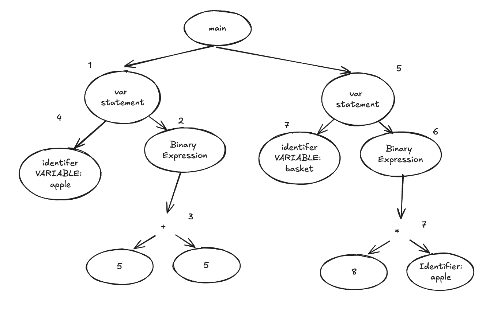

<div style="text-align: justify">
## 1. Introduction

An interpreter may seem like a magic box until one understands how it works. Anyone who writes code might want to learn how to build one to uncover the inner workings of this "magic box". Understanding the basic mechanics of an interpreter is beneficial, as it provides valuable insights into a tool used daily. However, when we have decided to create a programming language, we are often motivated to quickly build out features during the initial phases, focusing solely on adding new capabilities. As a result, testing and measuring performance often take a backseat. Without adopting proper engineering principles and setting up robust engineering infrastructures, the project can become exponentially complex as new features are added. Ultimately, this leads to things breaking down without proper warning, leaving engineers unsure where to start troubleshooting the problem. Additionally, without adequate testing, engineers will have minimal confidence in making changes, fearing that their updates can potentially cause new issues. Consequently slowing down the engineering process and possibly renders the project difficult to contribute to.

This dissertation aims to apply a structured engineering approach to language implementations focusing on correctness, performance, and robust engineering infrastructures. Through adopting these principles, we can make better decisions throughout the interpreter development process. Thus, ensuring that every aspect of the language design and implementation is grounded in sound engineering practices. By applying structured engineering principles, we identify and analyze the trade-offs involved in different approaches, providing valuable insights for more efficient language development in the future. By evaluating the engineering efforts, challenges and benefits in implementing this approaches in interpreter contructions. 

Additionally, this paper intend to offer readers with no prior experience in language implementations a introduction to the fundamental concepts of building a programming language. By providing a broad overview of the process, we aim to enhance understanding and offer practical insights into the complexities of language design and interpreter construction.

Correctness means that the program produces the correct result for a given input, an essential principle in software development. In building an interpreter, correctness involves multiple critical aspects, such as properly tokenizing the source text, ensuring the parser constructs a well-formed abstract syntax tree (AST), and more. To guarantee these properties, various mechanisms will be employed, ranging from writing unit tests for specific cases to creating integration tests and developing a definition interpreter to verify that the AST is accurately constructed. In this paper, we will apply these mechanisms at various stages of building an interpreter.

Beyond ensuring that our interpreter meets its functional requirements, we must also focus on its performance. Efficient interpreters are essential because they minimise overhead and optimise resource usage such as memory, enhancing overall system performance. We focus on monitoring the performance of each component of the interperter to allow us to assess how code changes impact efficiency and identify performance issues. By understanding the performance of each component, we can pinpoint bottlenecks and prioritise their optimisation. For instance, we can build a partial evaluator to reduce the size of the AST tree.

One critical aspect of building our interpreter is establishing a engineering infrastructure. A specified engineering process provides a defined approach to programming language implementation, ensuring the project remains organised. By defining engineering processes in advance, such as code deployment, we reduce the effort needed to manage these tasks, allowing us to concentrate on building the project. This process also allows us to track code changes effectively, which helps us switch between features. Additionally, creating workflows for repetitive tasks to automate the tasks helps minimise human error and saves time, further allowing us to focus on building the interpreter.

Therefore, we aim to develop a programming language called JSGO $L_{\text{JSGO}}$. This language is a variant of JavaScript that can be executed using the NodeJS runtime. Thus, allowing us to verify the correctness of our interpreter with NodeJS. We will build the interpreters from scratch in Go, with no third-party dependencies. This means that we will use Go as the host language for constructing the interpreters, relying solely on the Go standard library. 

The components we are building include a lexer, parser, and abstract syntax tree, which will be used to construct our tree-walking interpreter. To enhance performance, we will also create a bytecode interpreter alongside our tree-walking interpreter to improve speed and memory efficiency.

## 2. Literature review
How can we build an interpreter with zero prior knowledge? Given that the author had no prior experience with language implementations, one of the contributions of this paper is to create a guide that provides an overview of language implementation.

To address this, we examined materials that teach language implementation from the ground up. We found useful resources, such as Crafting Interpreters [reference], Compilation Essentials [reference], and the Writing an Interpreter and Writing a Compiler series by Thorsten Ball. These materials were evaluated for their comprehensiveness and beginner-friendly approach. Ultimately, we chose Thorsten's series, which offers a step-by-step guide to building a language called Monkey. Although Monkey is designed for educational purposes and lacks certain features like for-loops and uses put for printing instead of console.log, it provided a solid foundation. We leveraged Thorsen's series to build our interpreter and extended it to meet our specific requirements. We also used part of the series's coding logic for our interperter when appropriate.

Additionally, inspired by Compilation Essentials [reference], we developed a definitional interpreter to verify the well-formedness of the AST and a partial evaluator for optimising the AST. The materials in Compilation Essentials provided a Python-based approach to building a definitional interpreter and partial evaluator, which we adapted to our needs.

## 3. Methodology

### 3.1 Goals
In this paper, we focus on correctness, performance, and engineering infrastructure in building an interpreter for $L_{\text{JSGO}}$. See below for $L_{\text{JSGO}}$'s specification. $L_{\text{JSGO}}$ is a variation of JavaScript that can be excuted by NodeJS. The end goal of the interpreter is to be able to parse and evaluate a subset of the benchmarks from "Are We Fast Yet" [Reference]. Successfully passing the benchmarks will serve as strong evidence that our interpreter functions correctly. Futhermore, we will leverage the NodeJS runtime to run the sets of benchmarks in conjunction of with our interpreters to validate the correctness of the results.

**Language features**
```
var apple = "apple";
```
Above is the specification for JSGO.

Given that the NodeJS runtime benefits from years of rigorous engineering, aiming to build a fully supported JavaScript interpreter is beyond the scope of this project. Therefore, we carefully selected the essential features to implement. This approach also necessitates the modification of the benchmark from "Are We Fast Yet"[REFERENCE] to suit our use cases [Reference the benchmark]. However, the core methodology for proving the correctness of our interpreter remains unchanged: our interpreter must run the same files as NodeJS and produce identical results.

We will build the interpreters using Go, leveraging insights from "Writing an Interpreter" [REFERENCE] and "Writing a Compiler" [REFERENCE]to guide our development process. We will also reference the Go compiler's source code, drawing on its design to inform how Go constructs its own compiler for inspirations of our interperter.

We have chosen Go as the host language for the implementation because it is a statically typed language that promotes productivity, even for those new to the language. Additionally, Go's standard library offers a rich set of tools, enabling engineers to accomplish tasks without relying on third-party dependencies. Especially, Go's built-in support for testing and benchmarking is highly convenient, allowing us to easily write unit tests and benchmark our codes. This makes Go an suitable choice for this project.

### 3.2 Strategic for Correctness
To ensure correctness in every feature developed in our interpreters, we plan to enforce unit tests at each step as features are merged into the main codebase. Additionally, at a higher level, we will ensure that every major feature undergoes integration testing. The table below details the steps for ensuring correctness. This approach provides confidence that new additions to the project work as expected and our existing implementations are not broken.

Additionally, we will build a definition interpreter to to check if the AST is well formed.

#### 3.2.1 Lexical analysis
In this phase, we will build a lexer capable of correctly tokenizing concrete text. Therefore, to ensure **correctness** of the lexer unit test we need to set up unit test on every character the interpreter plan to supports. For example, the source text "var" needs to correctly identify as a keyword token with the relevant informations. 

```
var = Token(Type: Keyword, Literal: "var", Start: Line: 1, Col: )
"hello world" = Token(Type: string, Literal: "hello world", Start: {Line: 1, Col: 1}, End: {Line:1, Col: 11})
```

#### 3.2.2 Syntactic analysis
The parser will be constructed based on the proposed language features described earlier. It will receive tokens from the lexer and transform them into an abstract syntax tree (AST). Ensuring the correctness of the parser’s output is crucial, as it must accurately represent the source text. To validate this, we will write tests for each supported language feature to verify that the parser produces the correct AST.

In this example, the parser should correctly build the var statement into VarStatementNode with the correct reference to the identifier and string expression.

```
var message = "hello world"; -> VarStatementNode: {Identifier: Identifier{message}, Expression: String{"hello word"}}
```

Additionally, we will build a definitional interpreter based on the proposed language features. This interpreter will be used to check any AST to confirm that it conforms to the $L_{JSGO}$'s grammar.

During the syntactic analysis phase, the parser must verify that the syntax of the source text is correct and report any syntax errors, including the precise location of the error in the source text. To achieve this, we will implement simple error handling that reports the first instance of a grammatical error. Therefore, we are required to write tests to verify that the parser accurately reports errors to users. This approach also distinguishes our implementation from Writing an interpreter.

#### 3.2.3 Tree walking interpreter
Once we have a complete AST, we can begin constructing the interpreter. We will build a tree-walking interpreter $Inter_{tree}$, which will take the AST and evaluate the program.

To ensure the correctness of $Inter_{tree}$, we will run tests for each new feature introduced by the interpreter. 
```
var apple = 9; 
console.log(apple); // The interpreter needs to print out 9.
```

For example, when evaluating a var statement, we need to verify that the identifier is correctly declared. We will write test cases to check if the interpreter can correctly evaluate such statements.

Furthermore, we will assess the behavior of the interpreter with various features. This includes checking how the interpreter handles function and variable declarations. For instance, the following code snippet should correctly declare the identifier apple and assign it the value 9, declare a function eat, and correctly print the result of eat(apple).

Example integration test:
```
var apple = 9;
var eat = function(a) {
    return a - 3;
};

console.log(eat(apple)); // The interpreter needs to print out 6.
```

#### 3.2.4 Bytecode interpreter
Compared to a tree-walking interpreter, a bytecode interpreter converts the program into a sequence of instructions encoded in bytecode, hence the name. As some argue, bytecode interpreters can be faster due to their optimized execution of bytecode instructions (Author, Year). To enhance our language, we plan to build a bytecode interpreter, $Inter_{bytecode}$. This interpreter will take the AST we previously constructed and transform it into bytecode instructions for execution.

Similar to the check for correctness with the $Inter_{tree}$, we will use the same strategy to test the interpreter's features. For instance, we test if the compiler creates the correct bytecode intrustions for a var statement and also checks if the virtual machine can correctly execute the instructions to access variable.

Finally, we will cross-examine the results of both interpreters by comparing their outputs. Furthermore, we will validate their correctness by comparing the results with those produced by the NodeJS runtime.

### 3.3 Strategic for Performance
In this dissertation, we focus on measuring the performance of every feature developed. Specifically, we will monitor both the memory usage and execution speed of each features. Throughout all phases of interpreter construction, we emphasise benchmarking key features to assess their performance effectively.

Furthermore, we propose to build a partial evaluator and a bytecode interpreter for improving the performance of our language implementations.

#### 3.3.1 Lexical analysis
In this phase, we should benchmark the performance of the lexer of tokenisising the entire source file.

#### 3.3.2 Syntactic analysis
Based of the language specification, we can benchmark the parser with all the supported features of the language. This will allows us to have an awareness of the performance of our parser. In terms of improving the performance of the parser, we will be building a partial evaluator (AST optimisation) to efficiently reduce the size of the AST.

#### 3.3.3 Tree walking interpreter
After the interpreter is fully built according to the specifications. We can start using the test suite we have specify to be ran with our $Inter_{tree}$  to check if the interpreter produces correct results. Furthermore, we will be using the Nodejs runtime to excute to ensure that our interpreter produce the same results as Nodejs.

With a complete interpreter according to our language specification we had set up, we can then benchmark our interpreter to check for the performance of our interpreter. This allows us to understand how does our tree walking interpreter is doing.

In the aspect of improving the performance of the $L_{JSGO}$ we plan to build a bytecode interpreter.


### 3.4 Engineering infrastrure
The feature development process begins with a feature proposal in GitHub Issues. A pull request is then created based on the feature proposal. Once the pull request is reviewed, it will be merged into the main branch. We will use Git to track code changes. For continuous integration, we will define GitHub Actions workflows to perform checks such as tests, linting, and static analysis. Additionally, we will create a workflow to automate the benchmarking process and store the results. For continuous deployment, we will leverage the tool Goreleaser to automate the deployment of our project.

#### 3.5 Benchmarks 
Talk about your benchmark and what new test you have added. I am not too sure how I want to word this part, that belongs to methodology by I will revisit this part after I have written the implementation of benchmarks. Basically I want to saidf that i have to change the syntax to allow for interpreter ot work AND i HAVE also added new test cases. 

## Word
concrete text == source text == source codes == human readable tex

## Implementations
In this section, we will illustrate the implementation of our language by covering the processes of lexical analysis, syntactic analysis, tree-walking interpreter, and bytecode interpreter. We will highlight the key components of each phase to provide an overview of the implementation. References to the actual code implementation will be provided by hyperlinking the relevant words and noting them in the footnotes. The code snippets presented will usally the part relevant to the text and `...` will be used to denote the code abstracted.

## Lexical analysis
In this phase, we built a lexer to tokenize the user-defined source code. We have specified a huge range of tokens and JavaScript keywords. The rationale for this approach is because including a wide range of keywords requires minimal additional code management, even if some are not used later. The primary goals of the lexer are to tokenize numbers, floats, keywords, identifiers, strings, and relevant operators such as +, -, !, ==, and !=. Additionally, the lexer must accurately report the position of each token in the source text. To do that we have created 2 main components.

First is `Token` (Code 1), which represents the smallest element of the language. The fields `Start` and `End` denote the position of the token within the file, while `Literal` is the actual string representation of the token. `TokenType` is the key field used by the rest of the interpreter's components to identify different token types. The actual `TokenType` definition is: [TokenType](https://github.com/jf550-kent/jsgo/blob/5415802df0edaffac116917f7d912354a860edee/token/token.go#L23C1-L86C2) [Footnote](https://github.com/jf550-kent/jsgo/blob/5415802df0edaffac116917f7d912354a860edee/token/token.go#L23C1-L86C2).

The second component is the `Lexer` (Code 1), which is the program that transforms our user-defined source text into tokens. The `Lexer` has a field `src` that stores the source text, with the current pointer's index stored as `position` and the next pointer as `nextPosition`. The fields `line` and `col` represent the current character's position in the source file.

```
// Token is the smallest element of the JSGO
type Token struct {
	TokenType TokenType // Type of the token
	Literal   string // Actual string representation in the source code
	Start     Pos // Start position of the token
	End       Pos // End position of the token
}

// Lexer tokenization the source text for the language
type Lexer struct {
	src          []byte // source text for tokenization
	position     int    // current position at [Lexer.src]
	nextPosition int    // next position to be lex at [Lexer.src]

	line int // the current line at the source text
	col  int // the current column at the source text

	ch byte // the current byte at [Lexer.src]
}
```
<center>Code 1</center>

There are two key methods in the Lexer that perform tokenisation. In Go, this is denoted as func `(l *Lexer)`, where the `*` in `*Lexer` indicates a pointer to the `Lexer` struct. These methods are [`Lex`](https://github.com/jf550-kent/jsgo/blob/5415802df0edaffac116917f7d912354a860edee/lexer/lexer.go#L32) [FOOTNODE] (Code 2) and [`next`](https://github.com/jf550-kent/jsgo/blob/5415802df0edaffac116917f7d912354a860edee/lexer/lexer.go#L211) [FOOT] (Code 2).

The `next` method is responsible for correctly advancing the `Lexer` pointer to `l.src` and updating the correct column and line positions.

In the `Lex` method, we skip any whitespace before entering the switch statement. Within the switch statement, we examine the byte `l.ch`, which stores the current byte for the `Lexer` struct. We check for individual bytes using specific case statements. For instance, if `l.ch` matches `+`, it will create a token with the `TokenType` of `ADD`.

The default case is reached when `l.ch` does not match any of the specified case statements. In this case, we use the `l.isLetter` method to check if the current byte is a letter. If it is, the lexer will extract the letter, check if it matches a keyword, and create a keyword token if it does; otherwise, it will generate an identifier token.

If `l.ch` is not a letter, we then check if it is a digit. If it is a digit, we use [`l.getDigitToken`](https://github.com/jf550-kent/jsgo/blob/5415802df0edaffac116917f7d912354a860edee/lexer/lexer.go#L134) [FOOT] to create either a `Number` token or a `Float` token. If `l.ch` does not match any of the cases specified in our switch statement, we return an `Illegal` token.
```
func (l *Lexer) next() {
	if l.nextPosition == len(l.src) {
		l.ch = 0
		l.position = l.nextPosition
		return
	}
	l.position = l.nextPosition
	l.ch = l.src[l.position]
	switch l.ch {
	case '\n':
		l.col = 0
		l.line++
	default:
		l.col++
	}
	l.nextPosition++
}

func (l *Lexer) Lex() (token.Token, error) {
	var tok token.Token
	l.skipWhitespace()
	switch l.ch {
	case '+':
		pos := l.currentPos()
		tok = newToken(token.ADD, "+", pos, pos)
	
	...

	default:
		if l.isLetter() {
			start := l.currentPos()
			s, end := l.getLetter()
			if ty, ok := token.Keyword(s); ok {
				return newToken(ty, s, start, end), nil
			}
			return newToken(token.IDENT, s, start, end), nil
		}
		if l.isDigit() {
			return l.getDigitToken()
		}
		return newToken(token.ILLEGAL, "ILLEGAL", l.currentPos(), l.currentPos()), errors.New("ILLEGAL token")
	}
	l.next()
	return tok, nil
}
```
Code 2: [Lexer](https://github.com/jf550-kent/jsgo/blob/main/lexer/lexer.go)

Therefore, the Lexer processes the byte representations of our source code, examining each byte to transform it into tokens based on the `Lex` switch-case algorithm we have implemented. Code 3 illustrates the result of the Lexer tokenising the var statement.

```
var apple = 10;

// Result
Token(VAR, "var", {1, 1}, {1, 3})
Token(IDENT, "apple", {1, 5}, {1, 9})
Token(ASSIGN, "=", {1, 11}, {1, 11})
Token(NUMBER, "10", {1, 13}, {1, 14})
Token(SEMICOLON, ";", {1,15}, {1, 15})
```
<center>Code 3</center>

## Syntactic analysis
Building an AST allows us to represent the source text in a data structure that is easier for the interpreter to work with. In this phase, we created two main packages: `parser` and `ast`. The parser is responsible for taking the tokens and transforming them into an AST. The `ast` package specifies all the abstract syntax nodes available in $L_{JSGO}$. In the grammar of $L_{JSGO}$, $L_{JSGO}$ is essentially an array of statements. In $L_{JSGO}$, an expression evaluates to a value, whereas a statement executes an action without necessarily producing a value; depending on the context, it can have side effects. The statement types include ExpressionStatement, VarStatement, AssignmentStatement, ReturnStatement, ForStatement, and BlockStatement. For expressions, we have Number, Float, Identifier, Boolean, Function, Null, String, Array, Dictionary, BinaryExpression, IfExpression, UnaryExpression, CallExpression, Index, and BracketDeclaration. Each type of expression and statement represents a different kind of node. Some nodes have other nodes as their children. For instance, VarStatement has child nodes of Identifier and Expression.


We use a recursive descent parser to build the AST. In the parser package, we have one exported function `Parse`[^]. This function takes in the file name and source code in the form of byte slice. The `Parse` is a function that sets the lexer and parser, which are to recursivly build an abstract syntax tree with the root node as Main node (Code). A Main node represent the a JSOG program. In this package, we have the `parser`[^] struct. We highlight the `parser` struct's key method. Which are `p.parse()` (Code) [^] and `p.parseExpression(precedence int)`(Code) [^]. The `parser` struct's method `parse` parse a single statement which is used in the `Parse` function in a for to be called until there is a EOF token (Code). The `p.parseExpression(precedence int)` (Thuston) function is the main function that recursivly build any expression node.

```
func Parse(filename string, src []byte) *ast.Main {
  ... // lexer and parser setup code

	main := &ast.Main{Name: filename, Statements: []ast.Statement{}}
	for p.currentToken.TokenType != token.EOF {
		stmt := p.parse()
		if stmt != nil {
			main.Statements = append(main.Statements, stmt)
		}
		p.next()
	}

	return main
}
func (p *parser) parse() ast.Statement {
	switch p.currentToken.TokenType {
	case token.VAR:
		return p.parseVarStatement()
	case token.RETURN:
		return p.parseReturnStatement()
	case token.IDENT:
		switch p.nextToken.TokenType {
		case token.ASSIGN:
			return p.parseAssignmentStatement()
		}
	case token.FOR:
		return p.parseForStatement()
	}
	return p.parseExpressionStatement()
}

func (p *parser) parseExpression(precedence int) ast.Expression {
	unaryFunc, ok := p.unaryExpressionFuncs[p.currentToken.TokenType]
  ...
	result := unaryFunc()
	for !p.peekExpect(token.SEMICOLON) && precedence < p.peekPred() {
		binaryFunc, ok := p.binaryExpressionFunc[p.nextToken.TokenType]
    ...
		p.next()
		result = binaryFunc(result)
	}
	return result
}
```

Building on the var example (Code 3), the parser will need to take in the stream of token and build an var statement node and expression statement node. 
```
Token(VAR, "var", {1, 1}, {1, 3})
Token(IDENT, "apple", {1, 5}, {1, 9})
Token(ASSIGN, "=", {1, 11}, {1, 11}) ->  
Token(NUMBER, "10", {1, 13}, {1, 14})
Token(SEMICOLON, ";", {1,15}, {1, 15})
``` 

## Partial evaluator
The task of the partial evaluator is to evaluate the program with the static data trying to perform some optimistion up front in order to reduce the amount of operations at runtime.
var add = function (a) {
	var b = 8 + ((8 - 1) * 2); §§§§
	return b + a;
};

var add = function (a) {
	var b = 22; 
	return b + a;
};

In the above by performing the operation 8 + ((8 -1) * 2) up front and transforming it into a single AST node with value of 22 will efficiently saves memory and number of operations.  Imagine the add function is called 1000 times, the second will efficiently saves the memory for storing 3 binary node and skipped to perform the binary operations at runtime. One might argue this can help improve performance of the parser.

# Tree walking interpreter
The source code defined by the developer is first transformed into an AST by the parser, which is used by $Inter_{tree}$ to evaluate the program. In this case, $Inter_{tree}$ can treat the AST as a standard tree traversal problem, evaluating the program by visiting each node at runtime. During runtime, we need a way to represent values. Therefore, we created an object system to represent these values, keeping them separate from the AST nodes. The object system are our runtime value, the definition is in the `object` package. This approach helps maintain a clean separation between the AST node and object representation, with the object system being more lightweight compared to an AST node that contains syntactic information.

Our $Inter_{tree}$ is a Eval[^] function that takes in a AST node `Main` and a boolean debug to opt in for partial evaluation (more context). In `Eval`, it creates the top level environment which is then used for the private function `eval` function. An environment is the context that contains all variable and function bindings during the runitme. In our code, we implemented the environement struct that contain a map. The `eval` function is the main recursive function that walk the AST. In Go, we make a dinstiction if an declaration is exported by Capitalize the first character of the name declaration. This is why `Eval` is exported in the package and `eval` is not exported function. See the code for `eval` to examine how the function evaluate the abstract syntax tree. 

We will highlight one example of how does the function evaluate the tree. In the diagram, the interpreter evaluates the Abstract Syntax Tree (AST) as follows: In Step 1, it encounters the vsar statement node and evaluates the binary expression 5 + 5 first to get 10 (Step 2). This result is then bind to apple in Step 4. Next, the interpreter moves to Step 5 the var basket = 8 * apple; statement. In Step 6, it evaluates the binary expression 8 * apple, where apple is looked up (value 10), and the calculation 8 * 10 results in 80, which is then bind to basket. Therefore, by the end, apple holds the value 10, and basket holds the value 80.

```
var apple = 5 + 5;
var basket = 8 * apple;
```





# Partial evaluator
We have build a partial evaluator [^]. The goal of the partial evaluator is to reduce the size of the tree. It evaluate the program with the static data availbale to perform some optimistion up front in order to reduce the amount of operations at runtime.
```
// user defined add function
var add = function (a) {
	var b = 8 + ((8 - 1) * 2);
	return b + a;
};

// Transformed add function
var add = function (a) {
	var b = 22; 
	return b + a;
};
```
In the above by performing the operation 8 + ((8 -1) * 2) up front and transforming it into a single AST node with value of 22 will efficiently saves memory and number of operations.  Imagine the add function is called 1000 times, the second transformed add function will efficiently saves the memory for storing 3 binary node and skipped to perform the binary operations at runtime.

# Definition interpreter
A definition interpreter is used to determine whether a program conforms to the grammar of a specific language (). In our case, we applied this concept to build a checker that validates whether an Abstract Syntax Tree (AST) belongs to $L_{JSGO}$.
The checker uses a recursive function to evaluate the AST. For each node in the AST, the function checks if it adheres to the grammar of $L_{JSGO}$. This feature is enabled in debug mode, where we can check if the parser builds an AST that belongs to $L_{JSGO}$.

# Bytecode interpreter
We built an $Inter_{bytecode}$ that consist of a compiler[^] and a stack based virtual machine[^]. Our compiler is a program that converts the AST into bytecode instructions specifically for use by the virtual machine at runtime. Unlike traditional compilers that produce artifacts such as executables, our compiler generates bytecode instructions on-the-fly without producing permanent files. Once the bytecode instructions are generated by the compiler, the virtual machine will execute them following the fetch-decode-execute cycle.

Here we illustrate an simple example of how we implemented our stack based virtual machine. The source text has the same procees of building the AST representation as the $Inter_{tree}$. It is different after the syntaci phase, where our cimpiler will take the AST out the bytecode intsuctions and also a constant slice. We specific all our bytecode in [^] and the element of the constant slice is the element of our runtime representation valude which is the `object` Same as our tree interperter. 

The vm will then take the instruction and execute it. For instance, OpConstant 0: Pushes the constant index at the constant slice 0 onto the stack which is 1. OpConstant 1: Pushes another 1 onto the stack. OpAdd: Pops the first two element on the top of stack, and adds them and take the result to push to the top. OpSetGlobal: Pops 2 from the stack and assigns it to the global variable apple. The final result is that the global variable apple is set to 2
```
                  Bytecode instructions:       
                      OpConstant 0                
var apple = 1 + 2; -> OpConstant 1  
                      OpAdd
                      OpSetGlobal 

                     Constant slice:
                    Constant: [1, 2]
```

1. OpConstant 0
   - Push constant 1
   Stack: [1]

2. OpConstant 1
   - Push constant 2
   Stack: [1, 2]

3. OpAdd
   - Pop 1 and 2, add them (1 + 2 = 3), push result
   Stack: [3]

4. OpSetGlobal
   - Pop 3, and assign it to the global variable `apple`
   Global Variable `apple` = 3
   Stack: []

One of the key extension of our $Inter_{bytecode}$ from the Compiler book is support `for`. It also one of the hardest to do in the bytecode interpeter, therefore we will highltht it here.

```        
for (var i = 0; i < 10; i = i + 1) { 
  29;
}; 
```


# Engineering infrastruture
We have implemented Continuous Integration (CI) using GitHub Actions workflows configured through YAML files. The setup includes two workflows: the first workflow runs on every commit push to a pull request, performing tasks such as checking code formatting, setting up the Go environment, running all tests, and performing static code analysis. The second workflow triggers when changes are merged into the main branch and includes all the tasks from the pull request workflow, with additional steps to run benchmarks and record the results in the codebase. This setup automates benchmark recording and provides continuous performance monitoring for our application.

## Result
- Show the working of the interpereter
- code coverage
- 

## Evaluation
- code coverage
- Performance

In the code snippet ... is abrevaited. and foot node contain the lint to the actual code implementation hosted in github
</div>