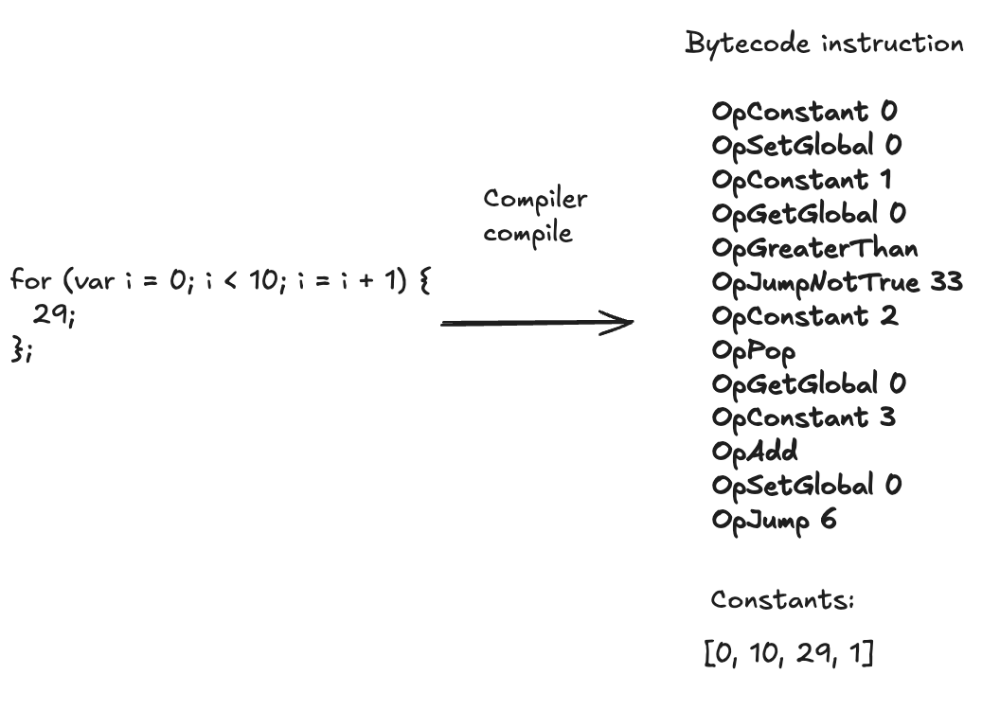
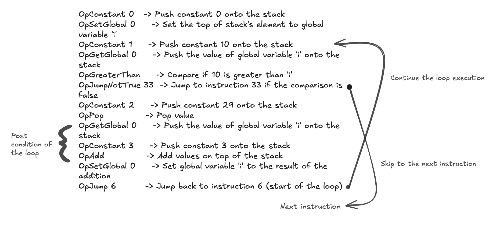

## 4.4 Bytecode interpreter
We built an $Inter_{bytecode}$ that consist of a compiler[^] and a stack based virtual machine[^] (VM). The compiler is a program that converts the AST into bytecode instructions specifically for the virtual machine at runtime. Unlike traditional compilers that produce artifacts such as executables, our compiler generates bytecode instructions on-the-fly without producing permanent files. Once the bytecode instructions are generated by the compiler, the virtual machine will execute them following the fetch-decode-execute cycle.

Here, we illustrate a simple example of how we implemented our stack-based virtual machine. The source text follows the same process of building the AST representation as the $Inter_{tree}$. However, it diverges after the syntactic phase, where our compiler takes the AST and generates bytecode instructions along with a constant slice. We define all our bytecode instructions in [Opcode](https://github.com/jf550-kent/jsgo/blob/5415802df0edaffac116917f7d912354a860edee/bytecode/bytecode.go#L53) [FOOTNOTE], and the elements of the constant slice represent the runtime values, encapsulated in our object, similar to our tree interpreter.

The vm will then take the instruction and execute it. For instance, OpConstant 0: Pushes the constant index at the constant slice 0 onto the stack which is 1. OpConstant 1: Pushes another 1 onto the stack. OpAdd: Pops the first two element on the top of stack, and adds them and take the result to push to the top. OpSetGlobal: Pops 2 from the stack and assigns it to the global variable apple. The final result is that the global variable apple is set to 2
```
                  Bytecode instructions:       
                      OpConstant 0                
var apple = 1 + 2; -> OpConstant 1  
                      OpAdd
                      OpSetGlobal 

                     Constant slice:
                    Constant: [1, 2]
```
```
1. OpConstant 0
   - Push constant 1
   Stack: [1]

2. OpConstant 1
   - Push constant 2
   Stack: [1, 2]

3. OpAdd
   - Pop 1 and 2, add them (1 + 2 = 3), push result
   Stack: [3]

4. OpSetGlobal
   - Pop 3, and assign it to the global variable `apple`
   Global Variable `apple` = 3
   Stack: []

```

One of the key extension of our $Inter_{bytecode}$ from the Compiler book is support `for` loop. Therefore we will hightlight it here.

P.S: will further discuss this
```        
for (var i = 0; i < 10; i = i + 1) { 
  29;
}; 
```




| Opcode            | Description |
|-------------------|-------------|
| OpConstant        |Load a constant         |
| OpAdd             |Add operation          |
| OpPop             |Pop the top of the element in the stack            |
| OpSub             |Minus operation             |
| OpMul             |Multiply operation             |
| OpDiv             |Division operation             |
| OpSHL             |<< operation            |
| OpXOR             |^ operation             |
| OpTrue            |Load true constant to stack             |
| OpFalse           |Load false constant to stack            |
| OpEqual           |Check the top 2 element of stack is equal            |
| OpNotEqual        |Check the top 2 element of stack is not equal               |
| OpGreaterThan     |Check if second top element is greater than top element of the stack       |
| OpMinus           |-<Top of the stack>|
| OpBang            |!<Top of the stack>            |
| OpJumpNotTrue     |Jump to a specific location of the instructions if top of the stack is not true       |
| OpJump            |Jump to a specific location of the instructions|
| OpNull            |Load null to stack         |
| OpGetGlobal       |Get global variable |
| OpSetGlobal       |Set global variable            |
| OpArray           |Create an array             |
| OpDic             |Create an dictionary             |
| OpIndex           |Index the top element of the stack, usally an array or object |
| OpCall            |Call the top element of the stack, usally a function|
| OpReturnValue     |Return the top element of the stack |
| OpReturn          |Just return |
| OpGetLocal        |Get local variable    |
| OpSetLocal        |Set local variable|
| OpGetBuiltIn      |Get built in function |
| OpClosure         |Create a new closure, usally for function|
| OpGetFree         |Declare how many free variables |
| OpCurrentClosure  |Used to go into another function's closure, for instance when vm is executing an function|
| OpIndexAssign     |Used to assign a for array and object `[1, 3, 4][0] = 9 or {}["a"] = 9`|
| OpFor             |Declare a for loop|

### 4.4.1 Correctness
The compiler generates bytecode intructions for the vm to execute. Therefore, we wrote tests to check if the compiler produce the correct bytecode intructions for the respective language features. Furthermore, we also wrote tests to checks if the vm can correctly evaluate the bytecode intructions. The table below shows the tests written to checks each features. 

| Test Name (Bytecode)              | Description |
|-------------------------|-------------|
| TestMake | Test if Make can create the correct byte slice |
| TestInstructionsString | Check if String method can print the bytecode instructions in human readable representation |
| TestReadOperands | Check if ReadOperands can read the correct bytecode | 

| Test Name (Compiler)              | Description |
|-------------------------|-------------|
| TestCompileOperation     |Check correct instructions for expression statement|
| TestBooleanExpression    |Check correct instructions for boolean expression |
| TestConditionals         |Check correct instructions for conditions|
| TestVarStatements        |Check correct instructions for var statement |
| TestBracket              |Check correct instructions for array and object indexing|
| TestStringExpression     |Check correct instructions for string literal |
| TestArrayLiterals        |Check correct instructions for array literals |
| TestDictionary           |Check correct instructions for object literals |
| TestIndexing             |Same as TestBracket but inside the [] we includes expression operations `[1, 2, 3][1 + 1]`|
| TestFunction             |Check correct instructions for function declaration |
| TestClosures             |Special test to check nested closure |
| TestRecursiveFunctions   |Check correct instructions for recursive function evaluation |
| TestCompilerScopes       |Check entering and existing scopes |
| TestBuiltIn              |Check correct instructions for built in function |
| TestForLoop              |Check correct instructions for loop instructions |

| Test Name (VM)    | Description |
|-------------------------|-------------|
|TestNumberOperation |Check number evaluation |
|TestFloatOperation |Check float evaluation |
|TestBooleanExpression |Check Boolean evaluation |
|TestConditionals |Check Condition evaluation |
|TestGlobalStatement |Check global variable declaration |
|TestStringExpression |Check string expression |
|TestArray |Check array declaration |
|TestDictionary | Check dictionary declaration |
|TestIndexing | Check indexing evaluation |
|TestCallingFunction|Check calling functions|
|TestCallingFunctionsWithLocalScope|Check calling functions with local variable |
|TestClosure|Check nested closure |
|TestRecursiveFibonacci|Check nested closure |
|TestBuiltIn|Check built in function |
|TestForLoop|Check for loop evaluation |
|TestBracket|Check bracket assignment `[2, 3, 4][0] = 1 // become [1, 3, 4]` |

### 4.4.2 Performance
Similar to section 4.3.2, We used the benchmarks in section 3.5 to benchmark the performance of our $Inter_{bytecode}$.