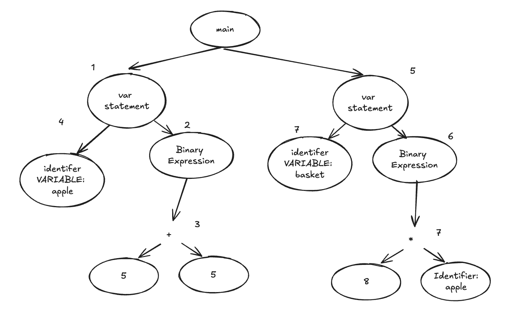

# Tree walking interpreter
The source code defined by the developer is first transformed into an AST by the parser, which is used by $Inter_{tree}$ to evaluate the program. In this case, $Inter_{tree}$ can treat the AST as a standard tree traversal problem, evaluating the program by visiting each node at runtime. During runtime, we need a way to represent values. Therefore, we created an object system to represent these values, keeping them separate from the AST nodes. The object system are our runtime value, the definition is in the `object` package. This approach helps maintain a clean separation between the AST node and object representation, with the object system being more lightweight compared to an AST node that contains syntactic information.

Our $Inter_{tree}$ is a Eval[^] function that takes in a AST node `Main` and a boolean debug to opt in for partial evaluation (more context). In `Eval`, it creates the top level environment which is then used for the private function `eval` function. An environment is the context that contains all variable and function bindings during the runitme. In our code, we implemented the environement struct that contain a map. The `eval` function is the main recursive function that walk the AST. In Go, we make a dinstiction if an declaration is exported by Capitalize the first character of the name declaration. This is why `Eval` is exported in the package and `eval` is not exported function. See the code for `eval` to examine how the function evaluate the abstract syntax tree. 

We will highlight one example of how does the function evaluate the tree. In the diagram, the interpreter evaluates the Abstract Syntax Tree (AST) as follows: In Step 1, it encounters the vsar statement node and evaluates the binary expression 5 + 5 first to get 10 (Step 2). This result is then bind to apple in Step 4. Next, the interpreter moves to Step 5 the var basket = 8 * apple; statement. In Step 6, it evaluates the binary expression 8 * apple, where apple is looked up (value 10), and the calculation 8 * 10 results in 80, which is then bind to basket. Therefore, by the end, apple holds the value 10, and basket holds the value 80.

```
var apple = 5 + 5;
var basket = 8 * apple;
```





# Partial evaluator
We have build a partial evaluator [^]. The goal of the partial evaluator is to reduce the size of the tree. It evaluate the program with the static data availbale to perform some optimistion up front in order to reduce the amount of operations at runtime.
```
// user defined add function
var add = function (a) {
	var b = 8 + ((8 - 1) * 2);
	return b + a;
};

// Transformed add function
var add = function (a) {
	var b = 22; 
	return b + a;
};
```
In the above by performing the operation 8 + ((8 -1) * 2) up front and transforming it into a single AST node with value of 22 will efficiently saves memory and number of operations.  Imagine the add function is called 1000 times, the second transformed add function will efficiently saves the memory for storing 3 binary node and skipped to perform the binary operations at runtime.

# Definition interpreter
A definition interpreter is used to determine whether a program conforms to the grammar of a specific language (). In our case, we applied this concept to build a checker that validates whether an Abstract Syntax Tree (AST) belongs to $L_{JSGO}$.
The checker uses a recursive function to evaluate the AST. For each node in the AST, the function checks if it adheres to the grammar of $L_{JSGO}$. This feature is enabled in debug mode, where we can check if the parser builds an AST that belongs to $L_{JSGO}$.

# Bytecode interpreter
We built an $Inter_{text{bytecode}}$ that consist of a compiler[^] and a stack based virtual machine[^]. Our compiler is a program that converts the AST into bytecode instructions specifically for use by the virtual machine at runtime. Unlike traditional compilers that produce artifacts such as executables, our compiler generates bytecode instructions on-the-fly without producing permanent files. Once the bytecode instructions are generated by the compiler, the virtual machine will execute them following the fetch-decode-execute cycle.

Here we illustrate an simple example of how we implemented our stack based virtual machine. The source text has the same procees of building the AST representation as the $Inter_{tree}$. It is different after the syntaci phase, where our cimpiler will take the AST out the bytecode intsuctions and also a constant slice. We specific all our bytecode in [^] and the element of the constant slice is the element of our runtime representation valude which is the `object` Same as our tree interperter. 

The vm will then take the instruction and execute it. For instance, OpConstant 0: Pushes the constant index at the constant slice 0 onto the stack which is 1. OpConstant 1: Pushes another 1 onto the stack. OpAdd: Pops the first two element on the top of stack, and adds them and take the result to push to the top. OpSetGlobal: Pops 2 from the stack and assigns it to the global variable apple. The final result is that the global variable apple is set to 2
```
                  Bytecode instructions:       
                      OpConstant 0                
var apple = 1 + 2; -> OpConstant 1  
                      OpAdd
                      OpSetGlobal 

                     Constant slice:
                    Constant: [1, 2]
```

1. OpConstant 0
   - Push constant 1
   Stack: [1]

2. OpConstant 1
   - Push constant 2
   Stack: [1, 2]

3. OpAdd
   - Pop 1 and 2, add them (1 + 2 = 3), push result
   Stack: [3]

4. OpSetGlobal
   - Pop 3, and assign it to the global variable `apple`
   Global Variable `apple` = 3
   Stack: []

One of the key extension of our $Inter_{text{bytecode}}$ from the Compiler book is support `for`. It also one of the hardest to do in the bytecode interpeter, therefore we will highltht it here.

```        
for (var i = 0; i < 10; i = i + 1) { 
  29;
}; 
```


# Engineering infrastruture
We have implemented Continuous Integration (CI) using GitHub Actions workflows configured through YAML files. The setup includes two workflows: the first workflow runs on every commit push to a pull request, performing tasks such as checking code formatting, setting up the Go environment, running all tests, and performing static code analysis. The second workflow triggers when changes are merged into the main branch and includes all the tasks from the pull request workflow, with additional steps to run benchmarks and record the results in the codebase. This setup automates benchmark recording and provides continuous performance monitoring for our application.